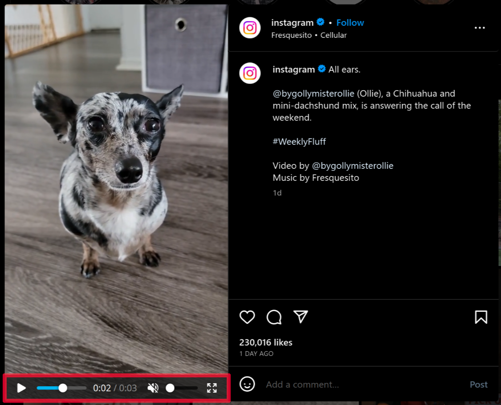

<h1 align="center">
     Video Control for Instagram 
</h1>

<p align="center">
Adds volume and play controls to Instagram videos.
</p>

<p align="center">
    <a href="https://addons.mozilla.org/firefox/addon/instagram-video-control/"></a>
    <a href="https://chrome.google.com/webstore/detail/jlebjkamppjaeoiinkjkgmecoahlefka/"></a>
</p>

<p align="center">
    
</p>

This extension adds playback controls to Instagram videos. This allows you to change the volume and seek through the
video.

## Development

Before you can start, make sure Git and NodeJS is installed.

Checkout the source code and navigate into the directory:

```
https://github.com/Arcus92/instagram-video-control.git && cd instagram-video-control
```

Install all required packages:

```
npm install
```

Compile and build the extension for all platform:

```
npm run build
```

The built extensions are located in `./dist`.

## Debugging

Always make sure you have built the extension with the previous steps.

**Launch build in Firefox:**

```
npm run start:firefox
```

**Launch build in Firefox on Android:**

```
WEB_EXT_ADB_DEVICE=<DEVICE-ID> npm run start:firefox-android
```

_Make sure `adb` is installed, your device is connected via USB and you have enabled USB-Debugging.
Run `adb devices` to list all connected devices. Replace `<DEVICE-ID>` with your Android device id._

**Launch build in Chromium:**

```
npm run start:chromium
```

## Download

- [Firefox Add-on](https://addons.mozilla.org/firefox/addon/instagram-video-control/)
- [Chrome Web Store](https://chrome.google.com/webstore/detail/jlebjkamppjaeoiinkjkgmecoahlefka/)

## Licence

[MIT License](LICENSE)
